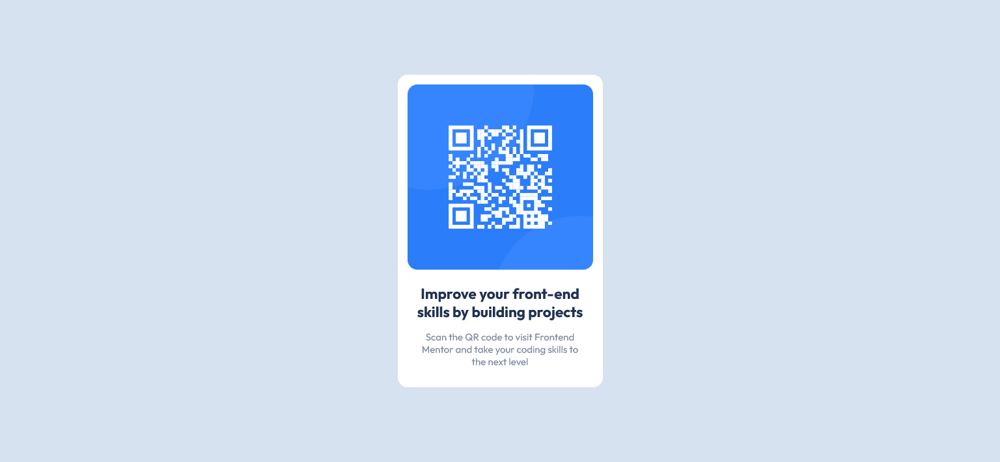

# Frontend Mentor - QR code component solution

This is a solution to the [QR code component challenge on Frontend Mentor](https://www.frontendmentor.io/challenges/qr-code-component-iux_sIO_H). Frontend Mentor challenges help you improve your coding skills by building realistic projects. 

## Table of contents

- [Overview](#overview)
  - [Screenshot](#screenshot)
  - [Links](#links)
- [My process](#my-process)
  - [Built with](#built-with)
  - [What I learned](#what-i-learned)
  - [Useful resources](#useful-resources)
- [Author](#author)

**Note: Delete this note and update the table of contents based on what sections you keep.**

## Overview

### Screenshot

### Links

- [Solution URL](https://github.com/aglopezn/qr-code-component)
- [Live Site URL](https://aglopezn.github.io/qr-code-component/)

## My process

### Built with

- Semantic HTML5 markup
- CSS BEM - Block Element Modifier methodology
- Flexbox

### What I learned

This challenge was useful to practice some basic usage of flexbox and BEM methodology in CSS standards. 

This is also a project to get involve in some common semantic html tags. 

### Useful resources

- [BEM](http://getbem.com/) - In this page you can check the convention to follow the BEM Methodology naming in CSS classes.
- [Semantic HTML](https://www.w3schools.com/html/html5_semantic_elements.asp) - This is the documentation from w3school about how to use semantic html tags.

## Author

- Website - [Giovany Nechiza](https://github.com/aglopezn)
- Frontend Mentor - [@aglopezn](https://www.frontendmentor.io/profile/aglopezn)
